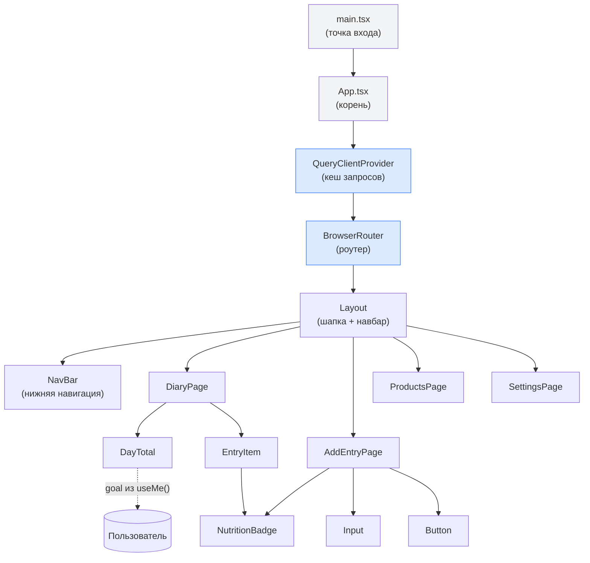
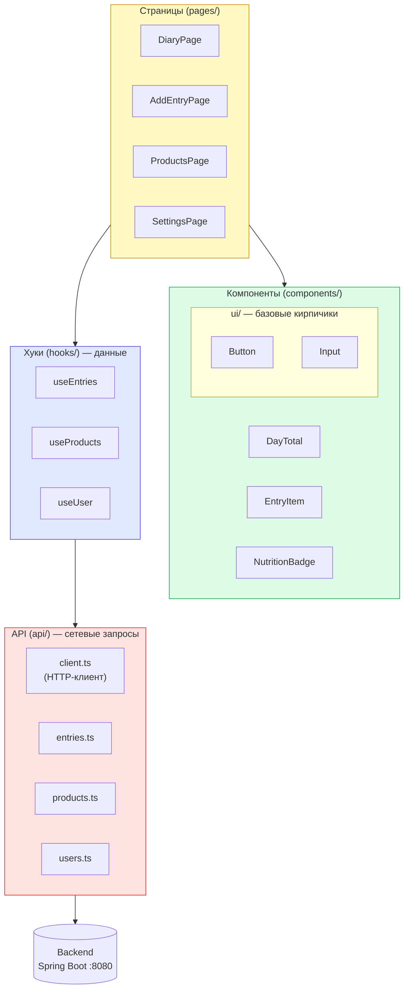
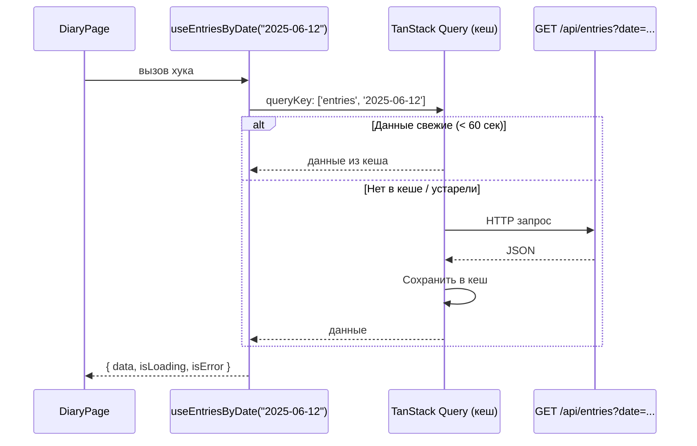
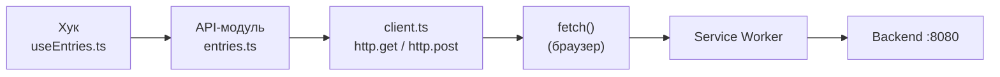

# Компоненты фронтенда

## Дерево компонентов



---

## Слои приложения



---

## Страницы

### DiaryPage — Дневник питания

**Главная страница.** Показывает всё съеденное за выбранный день.

```
┌────────────────────────────┐
│  ← 12 июня 2025  →        │  ← навигация по датам
├────────────────────────────┤
│  Итого за день             │
│  Калории  [████████░░] 80% │  ← DayTotal
│  Белки    [██████░░░░] 65% │
│  Жиры     [█████░░░░░] 55% │
│  Углеводы [███░░░░░░░] 30% │
├────────────────────────────┤
│  Завтрак                   │
│  Овсянка  200г             │  ← EntryItem
│  200 ккал · Б 7г · Ж 4г   │
├────────────────────────────┤
│  Обед                      │
│  Куриная грудка  150г      │  ← EntryItem
│  248 ккал · Б 46г · Ж 5г  │
└────────────────────────────┘
                         [+]   ← кнопка → AddEntryPage
```

**Откуда берёт данные:** `useEntriesByDate(date)` + `useMe()` (для цели)

---

### AddEntryPage — Добавить запись

**Двухшаговая форма.** Шаг 1: найти продукт. Шаг 2: ввести граммы.

```
Шаг 1: Поиск                   Шаг 2: Количество
┌────────────────────┐          ┌────────────────────┐
│ Поиск продукта     │          │ [Гречка ×]         │
│ [гречка_________] │  ──────▶ │ 200 ккал на 100г   │
│                    │          │                    │
│ Гречка варёная     │          │ Количество, г      │
│ 92 ккал · Б 4г    │          │ [150______________]│
│                    │          │                    │
│ Гречневая каша     │          │ [Завтрак] [Обед]   │
│ 340 ккал · Б 12г  │          │ [Ужин   ] [Перекус]│
│                    │          │                    │
│                    │          │ [Добавить]         │
└────────────────────┘          └────────────────────┘
```

**Откуда берёт данные:** `useProductSearch(query)` + `useCreateEntry()`

---

### ProductsPage — Справочник продуктов

**Поиск и просмотр продуктов.** В будущем — создание своих продуктов.

**Откуда берёт данные:** `useProductSearch(query)`

---

### SettingsPage — Настройки

**Форма для дневной Цели КБЖУ.** Калории обязательны, БЖУ — нет.

**Откуда берёт данные:** `useMe()` + `useUpdateDailyGoal()`

---

## Компоненты

### DayTotal

Блок итогов дня с прогресс-барами.

**Пропсы:**
| Проп | Тип | Описание |
|---|---|---|
| `total` | `Nutrition` | Суммарное КБЖУ за день |
| `goal` | `DailyGoal \| null` | Дневная цель; если `null` — прогресс-бары не показываются |

Если фактическое значение превышает цель — бар и число окрашиваются в красный.

---

### EntryItem

Одна строка в списке записей. Показывает название, граммы, КБЖУ, кнопку удаления.

**Пропсы:**
| Проп | Тип | Описание |
|---|---|---|
| `entry` | `Entry` | Данные записи |

Вызывает `useDeleteEntry()` при нажатии на крестик — запись удаляется и список обновляется автоматически.

---

### NutritionBadge

Инлайн-строка с КБЖУ: `250 ккал · Б 20 г · Ж 8 г · У 30 г`

Используется везде, где нужно компактно показать нутриенты.

**Пропсы:**
| Проп | Тип | Описание |
|---|---|---|
| `nutrition` | `Nutrition` | Значения КБЖУ |
| `className?` | `string` | Дополнительные CSS-классы |

---

### Button

Кнопка с вариантами стиля и состоянием загрузки.

| Вариант | Когда использовать |
|---|---|
| `primary` | Главное действие (сохранить, добавить) |
| `secondary` | Второстепенное действие |
| `ghost` | Ненавязчивые действия в тексте |
| `danger` | Удаление, деструктивные действия |

При `loading={true}` показывает спиннер и блокирует повторный клик.

---

### Input

Текстовое поле с лейблом и сообщением об ошибке.

| Проп | Тип | Описание |
|---|---|---|
| `label?` | `string` | Подпись над полем |
| `error?` | `string` | Ошибка под полем (красная рамка) |

---

## Хуки (hooks/)

Хук — функция, которая знает **как получить данные** и держит их в кеше.
Компонент не знает про `fetch` — он просто вызывает хук.



| Хук | Что делает |
|---|---|
| `useEntriesByDate(date)` | Записи за дату |
| `useCreateEntry()` | Создать запись, обновить кеш |
| `useDeleteEntry()` | Удалить запись, обновить кеш |
| `useProductSearch(query)` | Поиск продуктов (от 2 символов) |
| `useCreateProduct()` | Создать продукт |
| `useMe()` | Данные пользователя и его цель |
| `useUpdateDailyGoal()` | Сохранить новую цель |

---

## API-клиент (api/)



`client.ts` содержит один объект `http` с методами `get`, `post`, `put`, `delete`.
Он добавляет `Content-Type: application/json` и единообразно обрабатывает ошибки — бросает `HttpError` с кодом статуса.

Каждый API-модуль (`entries.ts`, `products.ts` и т.д.) — просто набор функций, каждая соответствует одному REST-эндпоинту.
