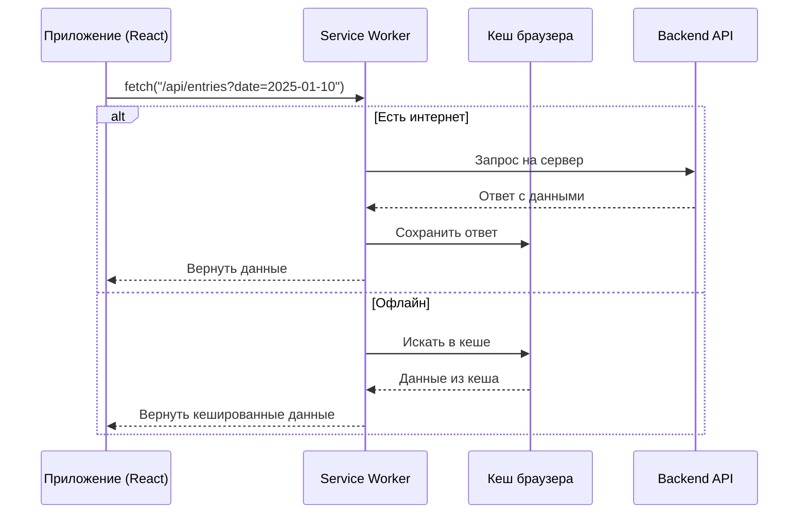
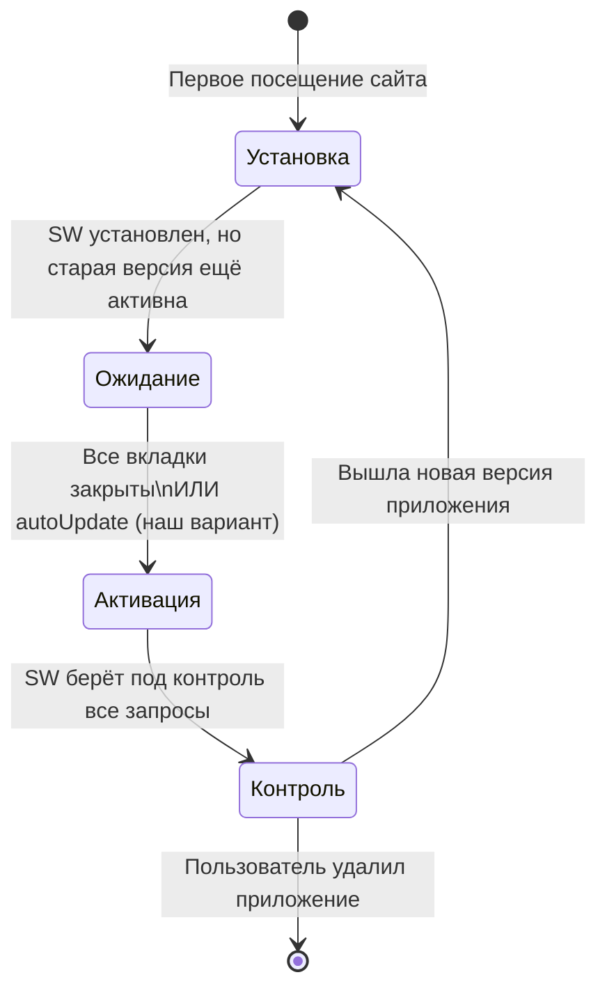
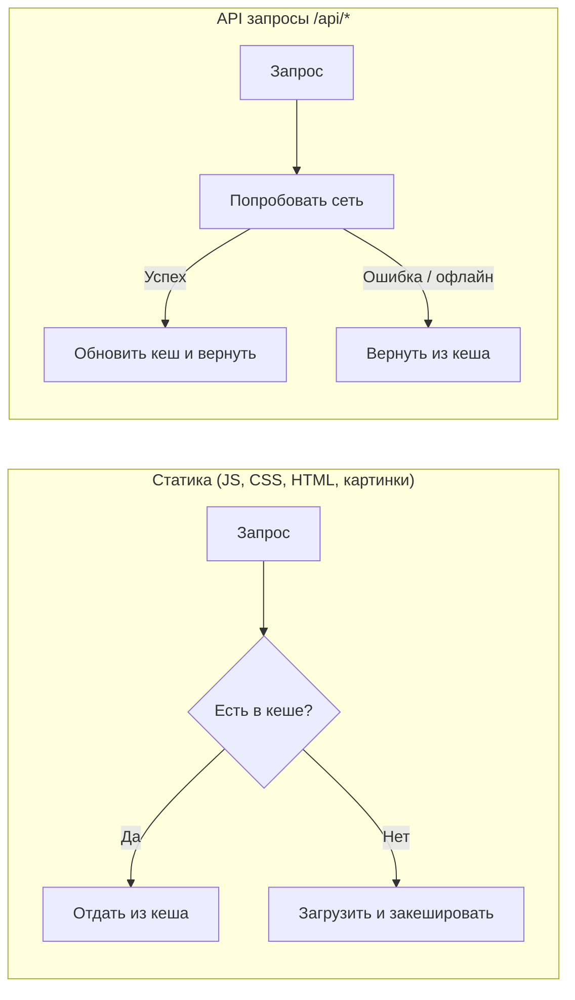
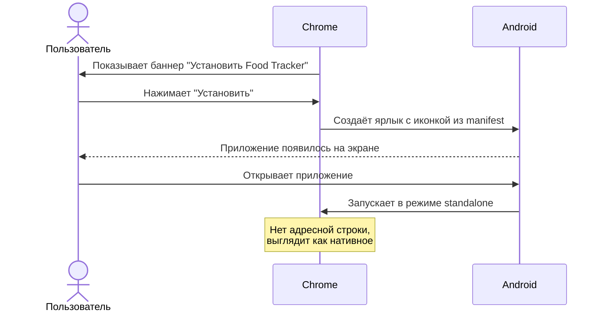

# Как работает PWA

Progressive Web App — это обычный веб-сайт, который браузер превращает в "квазинативное" приложение.
Пользователь устанавливает его на экран телефона, и оно открывается без адресной строки, работает офлайн, выглядит как приложение из App Store.

## Три кита PWA

| Компонент | Файл в проекте | Зачем |
|---|---|---|
| **Service Worker** | генерируется `vite-plugin-pwa` | кеш, офлайн-режим, перехват сетевых запросов |
| **Web App Manifest** | конфиг в `vite.config.ts → manifest` | название, иконки, цвет, режим запуска |
| **HTTPS** | настройка сервера/хостинга | браузер регистрирует SW только на защищённом соединении |

---

## Как Service Worker перехватывает запросы

Когда приложение первый раз загружается, браузер регистрирует Service Worker — отдельный JS-поток, который живёт в фоне.
После этого **весь сетевой трафик** страницы проходит через него.



---

## Жизненный цикл Service Worker



В нашем проекте выбрана стратегия `registerType: 'autoUpdate'` — когда выходит новая версия SW,
он активируется автоматически, без ожидания закрытия вкладок.

---

## Стратегии кеширования

Для разных типов ресурсов используются разные стратегии:



| Тип ресурса | Стратегия | Срок жизни кеша |
|---|---|---|
| JS, CSS, HTML | Cache First | до новой версии SW |
| PNG, SVG, иконки | Cache First | до новой версии SW |
| `/api/*` | Network First | 5 минут |

---

## Установка на устройство

### Android (Chrome, Samsung Browser, Firefox)
Браузер сам показывает баннер «Добавить на главный экран» через несколько секунд.
Приложение появляется в списке установленных, можно удалить как обычное.



### iOS (Safari)
На iOS нет автобаннера — пользователь устанавливает вручную.

```
Safari → кнопка "Поделиться" → "На экран «Домой»" → "Добавить"
```

> **Ограничения iOS:** до iOS 16.4 не было push-уведомлений. Начиная с iOS 16.4
> уведомления доступны, но пользователь должен сначала добавить приложение на экран.

### Сравнение платформ

| Возможность | Android | iOS |
|---|---|---|
| Установка | Автобаннер | Вручную через Safari |
| Работа офлайн | ✅ | ✅ |
| Push-уведомления | ✅ | ✅ (с iOS 16.4) |
| Доступ к камере | ✅ | ✅ |
| Геолокация | ✅ | ✅ |
| Публикация в Google Play | ✅ через TWA | ❌ |
| Публикация в App Store | ❌ | ❌ |

---

## Как PWA выглядит на телефоне

```
┌─────────────────────────┐
│  Food Tracker           │  ← Заголовок из manifest.name
│ ─────────────────────── │
│                         │
│   [иконка на экране]    │  ← icon-512.png из manifest.icons
│                         │
│   Открывается в режиме  │
│   standalone: нет       │
│   адресной строки,      │
│   нет кнопок браузера   │
│                         │
│   Статус-бар окрашен    │
│   в theme_color #16a34a │  ← зелёный, наш brand-600
└─────────────────────────┘
```

---

## Файлы, которые генерирует vite-plugin-pwa

При сборке (`npm run build`) плагин автоматически создаёт:

- `dist/sw.js` — Service Worker со всей логикой кеширования
- `dist/manifest.webmanifest` — манифест с иконками и метаданными
- `dist/workbox-*.js` — библиотека Workbox (кеш-стратегии)

Разработчику писать Service Worker вручную не нужно — плагин генерирует его из конфига в `vite.config.ts`.
